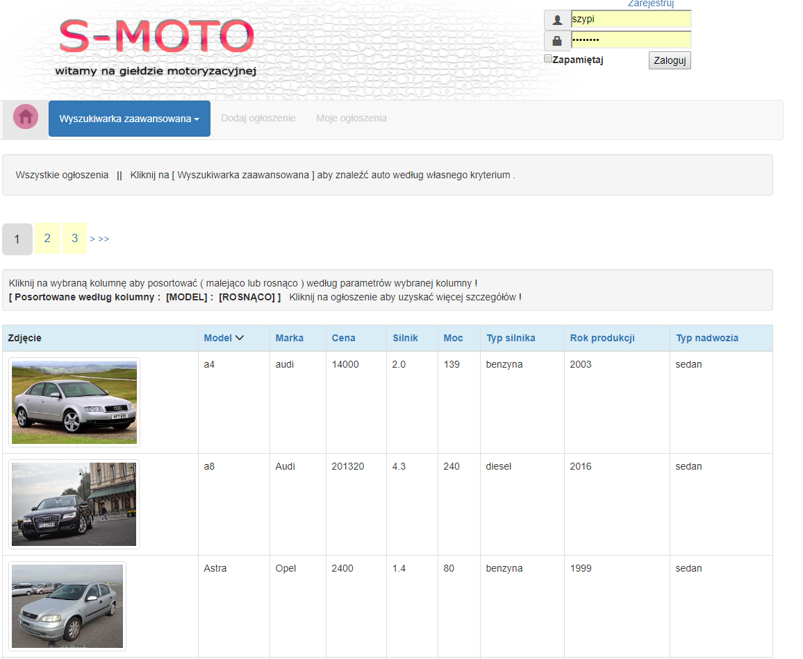
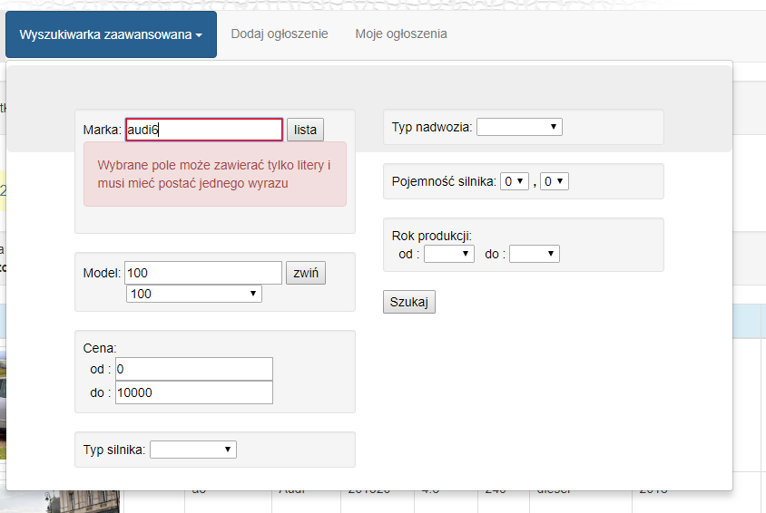
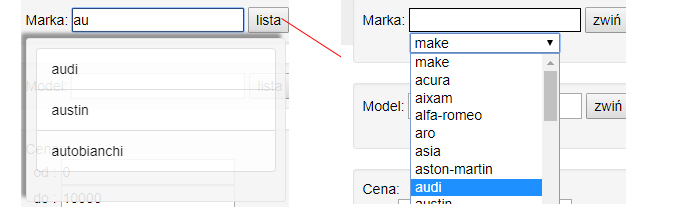
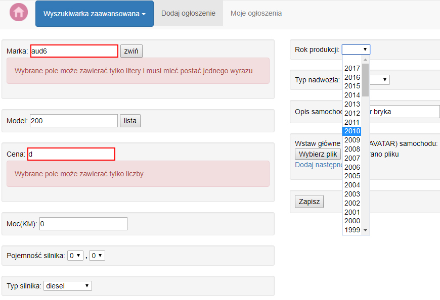
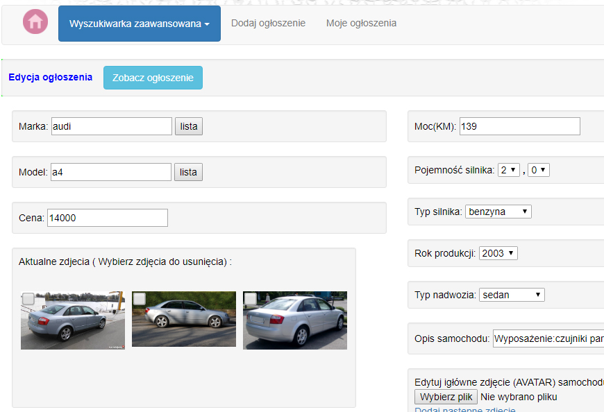
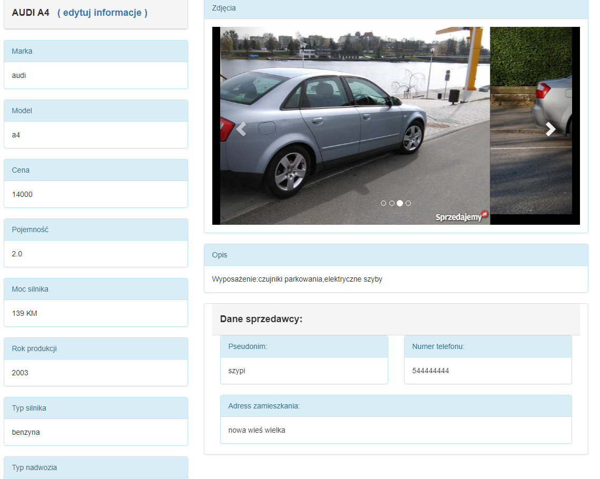

Projekt Moto giełdy . http://motoszypi.herokuapp.com/ napisany w PHP (SYMFONY 3.4) /JQUERY/JS/AJAX/

Przykładowe dane logowania dla testu : login:szypi hasło:haker777

1. Zdjęcia niektorych modułów aplikacji

1.1 Strona główna :

1.2 Wyszukiwarka:

Rodzaje wyszukiwań :

1.2 Dodawanie ogłoszenia :

1.3 Edycja ogłoszenia : 

1.4 Podgląd ogłoszenia : 

